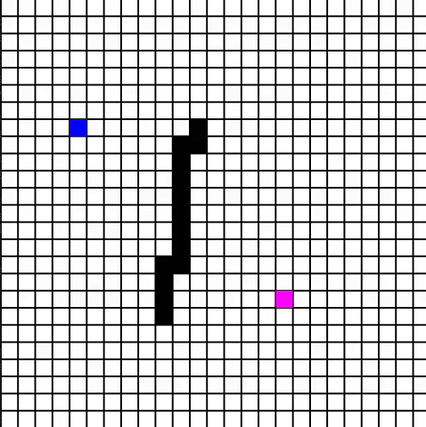

# Pathfinding_Visualizer
A visualizer for pathfinding algorithms like A*

## Run
Just run the visualize.py script inside the core directory
```
python visualize.py
```

## Setting start, finish, and walls
- Press 'a' on a cell to select it as starting point.
- Press 's' on a cell to select it as finish point.
- Hold down left click to draw walls.



